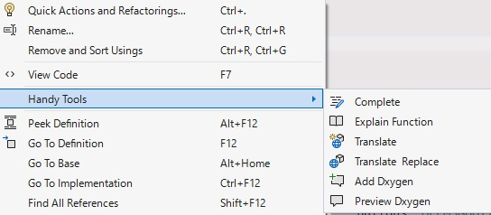
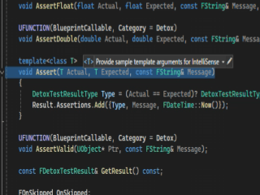
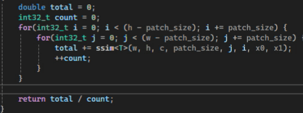
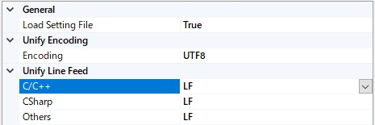
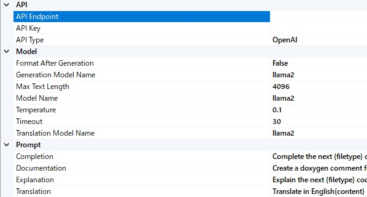

# Overview
Some tools for code editing.

# Features

- Unify file's line feed
- Unify file's character encoding
- Editing command with LLM
  - Support OpenAI API
  - Support local API endpoint
- Others
  - Load settings from a file. Able to use an individual setting for each projects.

## AI Features
Just right click on the target code, and select command from Handy Tools submenu.


| Command                 | Place                 | Description                                                        |
| :------                 | :----                 | :----------                                                        |
| Add Multi Line Complete | Cursor Position       | Fill in the middle at the cursor position.                         |
| Explain Function        | Selection or one line | Explain a funciton which the selection or one line is overlapping. |
| Translate               | Selection             | Translate the selected text on the chat view.                      |
| Add Doxygen             | Selection or one line | Add Doxygen style document for a function,                         |
|                         |                       | which the selection or one line is overlapping.                    |
| Preview Doxygen         | Selection of one line | Preview Doxygen style document for a function on the chat view.    |
| Add One Line Completion | Cursor Position       | Fill in the middle at the cursor position only one line            |

- Add Doxygen comment


- One line completion


*Notice: now supports only C/C++*

## Settings

### General


| Category        | Item               | Description                     | Default |
| :-------        | :---               | :----------                     | :------ |
| General         |                    |                                 |         |
|                 | Load Setting Files | Load settings from a file       | true    |
| Unify Encoding  |                    |                                 |         |
|                 | Encoding           | Character encoding for unifying | UTF8    |
| Unify Line Feed |                    |                                 |         |
|                 | C/C++              | Line feed for C/C++             | LF      |
|                 | CSharp             | Line feed for C#                | LF      |
|                 | Others             | Line feed for other text format | LF      |

### AI


| AI     | Item                    | Description                                                     | Default |
| :---   | :---                    | :----------                                                     | :------ |
| API    | API Endpoint            | Endpoint Address                                                | empty   |
|        | API Key                 | API Key                                                         | XXX     |
|        | Completion Endpoint     | Endpoint Address for completion                                 | empty   |
| Model  | Model for General       | Model for general tasks                                         | llama2  |
|        | Model for Generation    | Model for generation or code FIM tasks                          | llama2  |
|        | Model for Translation   | Model for translation                                           | llama2  |
|        | Format After Generation | Whether format text after generation                            | false   |
|        | Max Text Length         | Max text length for passing to LLM (in chars, not context size) | llama2  |
|        | Temperature             | Temperature in generation parameters                            | 0.1     |
|        | RealTime Completion     | Automatic suggest completions on every key strokes              | False   |
|        | Completion Interval     | Interval time in milliseconds for suggestion                    | 1000    |
|        | MaxCompletionInputSize  | Max text length around cursor point for completion              | 4000    |
|        | MaxCompletionOutputSize | Max output text length for line completion                      | 64      |
| Prompt | Completion              | Prompt for completion tasks                                     |         |
|        | Documentation           | Prompt for documentation tasks                                  |         |
|        | Explanation             | Prompt for explanation tasks                                    |         |
|        | Translation             | Prompt for translation tasks                                    |         |

### Setting File
Try to find a setting file,
1. From the directory of the focused file
2. Search **_handytools.xml**
3. If the current directory don't have ".git" or ".svn", move to upper directory and repeat from 2.

#### General Settings
An example general setting file "_handytools.xml" is below,

```xml
<?xml version="1.0" encoding="utf-8"?>
<HandyTools>
    <UnifyLineFeed>
        <Code lang="C/C++">
            LF
        </Code>
        <Code lang="CSharp">
            CRLF
        </Code>
        <Code lang="Others">
            LF
        </Code>
    </UnifyLineFeed>
    <UnifyEncoding>
        <Encoding>UTF8</Encoding>
    </UnifyEncoding>
</HandyTools>
```

#### AI Settings
An example settings for OpenAI API endpoint,

```xml
<?xml version="1.0" encoding="utf-8"?>
<HandyTools>
	<AI>
		<ModelGeneral>llama2</ModelGeneral>
		<ModelGeneration>llama2</ModelGeneration>
		<ModelTranslation>llama2</ModelTranslation>
		<ApiKey>XXX</ApiKey>
		<ApiEndpoint>http://localhost:9090</ApiEndpoint>
		<CompletionEndpoint>http://localhost:9090</CompletionEndpoint>
		<FormatResponse>False</FormatResponse>
		<Temperature>0.1</Temperature>
		<Timeout>30</Timeout>
		<RealTimeCompletion>False</RealTimeCompletion>
		<MaxTextLength>3000</MaxTextLength>
		<CompletionIntervalInMilliseconds>1000</CompletionIntervalInMilliseconds>
		<MaxCompletionInputSize>4000</MaxCompletionInputSize>
		<MaxCompletionOutputSize>64</MaxCompletionOutputSize>
		<PromptCompletion>&lt;|fim_prefix|&gt;{prefix}&lt;|fim_suffix|&gt;{suffix}&lt;|fim_middle|&gt;</PromptCompletion>
		<PromptExplanation>Explain the next {filetype} code.\ncode:{content}</PromptExplanation>
		<PromptTranslation>Translate in English\n\n{content}</PromptTranslation>
		<PromptDocumentation>Create a doxygen comment for the following C++ Function. doxygen comment only\n\n{content}</PromptDocumentation>
	</AI>
</HandyTools>
```

# ToDo

# License
This software is distributed under two licenses 'The MIT License' or 'Public Domain', choose whichever you like.

# Release
- v.0.5.7
  - Change progress display
  - Output logs for debugging
- v.0.5.6
  - Fix null exception
- v.0.5.5
  - Delete Ollama API support
  - Add AI one line completion
- v.0.5.4
  - Fix failing to detect function's declarations
- v.0.5.3
  - Remove supports of Unreal
- v.0.5.2
  - Add template and Unreal's FUNCTION macro
- v.0.5.1
  - Fix some bugs about async
  - Apply short cut keybindings
- v.0.5.0
  - Remove full-text search, because Visual Studio itself has integrated full-text search
  - Add AI commands
- v.0.4.0
  - Add a search window menu
- v.0.3.0
  - Fix failures on loading settings
- v.0.2.0
  - Add full-text search
- v.0.1.0
  - Initial release

